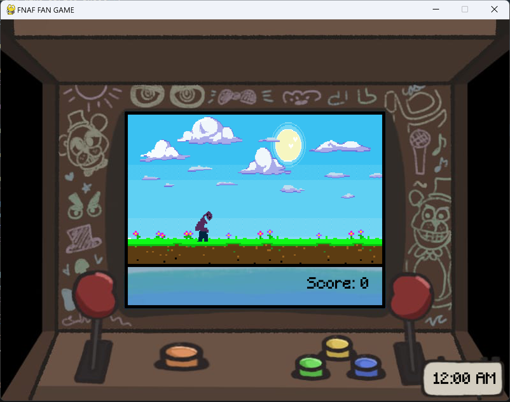
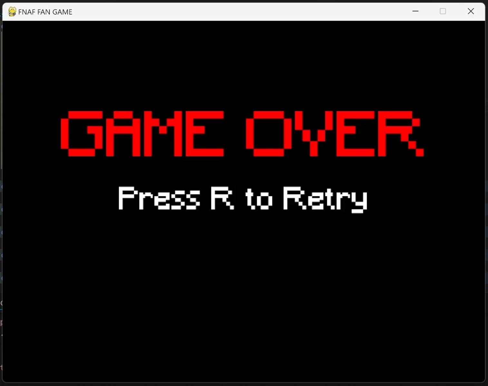

# ArcadeFNAF
Vickelsteins August Santoso/ 2802505941
---

A simple FNAF fan game. Taking inspiration from Bloods & Gears. Enjoy this pygame version!

# Screenshots
---
# Main Screen
---

# Win Screen
---

# Lose Screen
---

# Dependencies
---
- Python 3
- Pygame
- Random

# Installation
--- 
- Download it as a ZIP
- Extract all the files
- Run 'FNAFFANGAME.py' on Visual Studio Code

# Controls
---
- 'ESC' to pause the dinosaur game
- 'space' to jump
- 'a' to change your camera to 'left'
- 'd' to change your camera to 'right'
- 'f' to turn on your flashlight

# Tips & Tricks
---
- Each animatronic will only stay for a couple of seconds so make sure to despawn it!
- They won't go away unless you burn their eyes for >= 3 seconds!
- Make sure you got 143 as your scores or survive till 6 AM!
